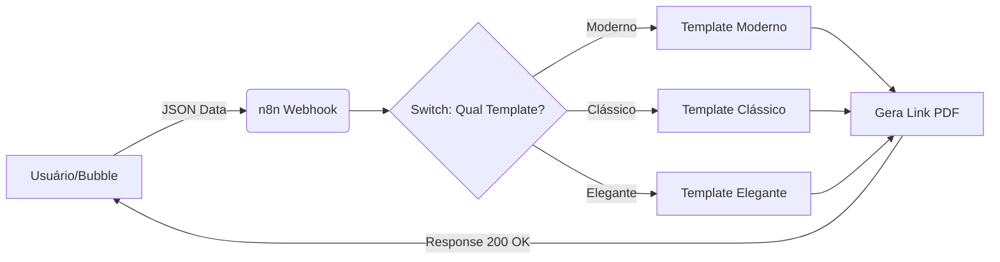

# 🎓 Gerador de Certificados Automatizado (Bubble.io + n8n) -(Projeto de Estudo)

Este é um dos meus primeiros projetos utilizando ferramentas No-Code. O objetivo foi criar um sistema simples que gera um PDF personalizado automaticamente quando o usuário clica em um botão.

## 💡 O que o projeto faz?

É uma aplicação simples onde o usuário:
1. Digita o nome do aluno, curso e carga horária.
2. Escolhe um modelo visual (Moderno, Clássico ou Elegante).
3. Recebe um link para baixar o certificado em PDF pronto.

## 🛠️ Ferramentas que utilizei

Usei três ferramentas diferentes:

* **Bubble.io:** Para criar a tela (Frontend) e o botão de ação.
* **n8n:** Para fazer a lógica "nos bastidores" (Backend). É ele quem recebe os dados e decide qual modelo usar.
* **PDFMonkey:** Para desenhar o certificado (HTML/CSS) e gerar o arquivo final.

## 📸 Demonstração Bubble
### Área para Gerar o Certificado:
#### **SIDEBAR**:

### **Tipos de Templates**: 
#### **1 - Moderno:**

#### **2 - Clássico:**

#### **3 - Elegante:**

## **Tela completa**

### Área de registro:

 ---
🔗 **Acesse o projeto:** (https://gyovannab23-76958.bubbleapps.io/version-test/?debug_mode=true) 
### OBSERVAÇÃO

**⚠️ Notas Importantes (Leia antes de testar)**

1. **Ambiente de Desenvolvimento:** O link acima roda em modo de teste (`version-test`), por isso você verá uma barra de Debug na parte inferior da tela.
2. **Limites da API:** Este projeto utiliza o plano gratuito do PDFMonkey. **Caso o PDF não seja gerado**, é provável que o limite mensal de processamento da API tenha sido atingido. Se isso acontecer, peço desculpas!

## 📸 Demonstração do n8n

## 📸 Demonstração do Certificado Gerado:
 

## 🛠️ Stack Tecnológico & Arquitetura

O fluxo de dados foi construído da seguinte forma:

1.  **Frontend (Bubble.io):**
    * Captura de dados (Nome, Curso, Carga Horária, Instituto).
    * API Connector configurado para disparo de Webhooks.
    * Lógica de UX para aguardar a resposta da API (Loading states).

2.  **Orquestração (n8n):**
    * **Webhook Receiver:** Recebe o JSON do Bubble.
    * **Switch Logic:** Roteamento condicional inteligente que identifica qual template o usuário escolheu (Moderno, Clássico ou Elegante) e direciona para o fluxo correto.
    * **Tratamento de Erros:** Configuração de "Wait for Completion" para garantir que o link só seja retornado após a renderização total do arquivo.

3.  **Geração de Documentos (PDFMonkey):**
    * Templates HTML/CSS responsivos.
    * Renderização de variáveis dinâmicas e imagens de fundo via URL pública.

---

## 🎥 Demonstração do projeto
Este projeto foi desenvolvido em Bubble, com geração de certificados em PDF
utilizando PDFMonkey e automação via n8n.

## 👨‍💻 Autor
Gyovanna Garcês 
